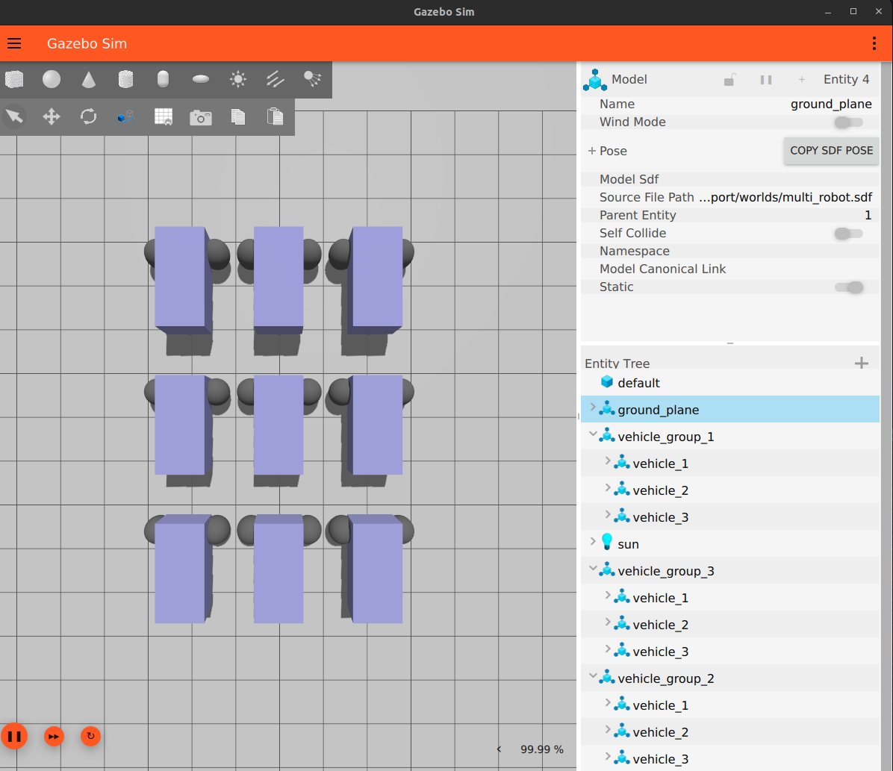

# Demo Namespace Support

This demo shows namespace support for nested models in Gazebo.

Each `vehicle_group` contains three vehicles:

- `banana`
- `orange`
- `grape`

Each vehicle has these main topics:

- `imu`: IMU sensor output.
- `odometry`: odometry output from the `DiffDrive` plugin.
- `tf`: tf output from the `DiffDrive` plugin.
- `cmd_vel`: velocity command input for the `DiffDrive` plugin.
- `enable`: enable input for the `DiffDrive` plugin.

The world creates three groups in different ways:

- `vehicle_group_1` is defined directly in the world sdf file.
- `vehicle_group_2` is spawned by the `ros_gz_sim create` node with `-ns __name__`.
- `vehicle_group_3` is spawned by `gz_spawn_model` with `entity_namespace="__name__"`.

`__name__` means the group model name is used as the namespace.

## Run & Check

* Build the package, source the workspace, and run:

  ```bash
  ros2 launch demo_ns_support demo_ns_support.launch.py
  ```

* This launch file also starts `ros_gz_bridge` with the bridge configuration in `config/bridge.yaml`.
 
  Check Gazebo topics with:

  ```bash
  gz topic --list
  ```

  Check ros topics with:

  ```bash
  ros topic list
  ```

## Scene



## Expected Topic Names

Each group gets its own topic namespace. The main topics follow this pattern:

```text
/<vehicle_group>/<vehicle>/imu
/<vehicle_group>/<vehicle>/odometry
/<vehicle_group>/<vehicle>/tf
/<vehicle_group>/<vehicle>/cmd_vel
/<vehicle_group>/<vehicle>/enable
```

Examples:

```text
/vehicle_group_1/banana/imu
/vehicle_group_1/banana/odometry
/vehicle_group_1/banana/tf
/vehicle_group_1/banana/cmd_vel
/vehicle_group_1/banana/enable

/vehicle_group_2/orange/imu
/vehicle_group_2/orange/odometry
/vehicle_group_2/orange/tf
/vehicle_group_2/orange/cmd_vel
/vehicle_group_2/orange/enable

/vehicle_group_3/grape/imu
/vehicle_group_3/grape/odometry
/vehicle_group_3/grape/tf
/vehicle_group_3/grape/cmd_vel
/vehicle_group_3/grape/enable
```

## Result

Namespace support keeps the topic names short and avoids conflicts between
groups. The same `vehicle_group/model.sdf` can be reused for all three spawn
methods without making separate SDF files for each group.
